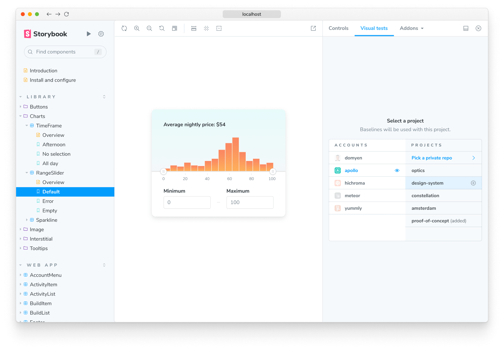
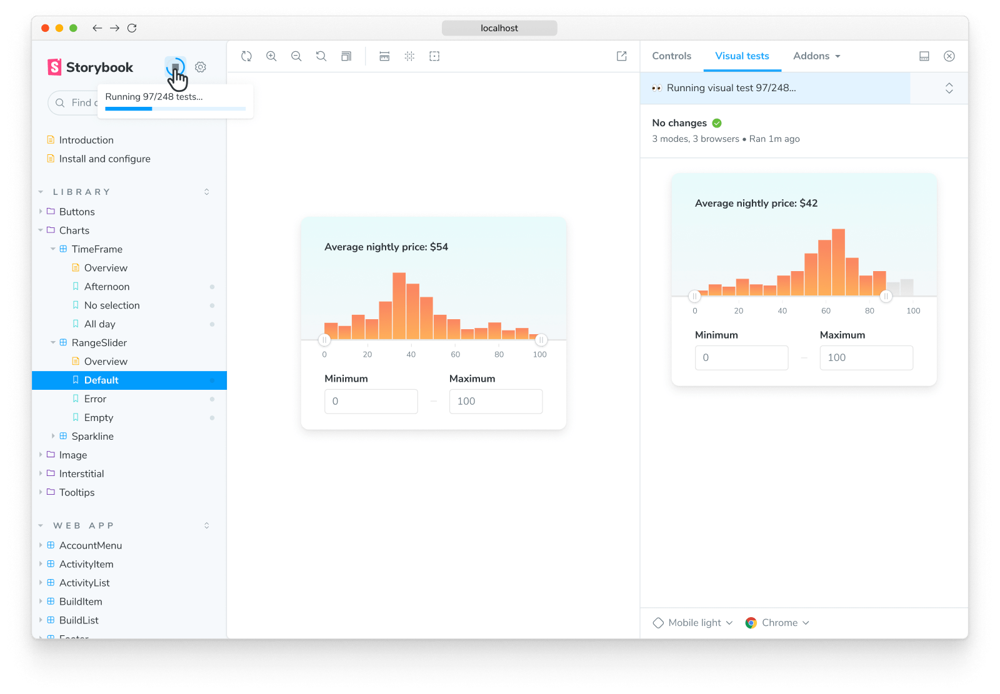

Visual tests catch bugs in UI appearance. They work by taking screenshots of every story and comparing them to previous versions to identify visual changes. This is ideal for verifying layout, color, size, contrast, and any other visual aspect of your UI.

Storybook supports cross-browser visual testing natively using [Chromatic](https://www.chromatic.com/storybook/?ref=storybook_site), a cloud service made by the Storybook team. When you enable visual testing, every story is automatically turned into a test. This gives you instant feedback on UI bugs directly in Storybook.

<video autoPlay muted playsInline loop>
  <source
    src="component-visual-testing-optimized.mp4"
    type="video/mp4"
  />
</video>

### Install Visual Tests addon

Install the Visual Tests addon by running the following command:

<!-- prettier-ignore-start -->

<CodeSnippets
  paths={[
    'common/visual-test-addon-install.npm.js.mdx',
    'common/visual-test-addon-install.pnpm.js.mdx',
    'common/visual-test-addon-install.yarn.js.mdx'
  ]}
/>

<!-- prettier-ignore-end -->

<Callout variant="info">

Storybook 7.4 or higher is required. Read the [migration guide](../migration-guide.md) to upgrade your project.

</Callout>

### Enable visual tests

When you start Storybook, you'll see a new addon panel for Visual Tests where you can run tests and view results.


To enable visual testing, sign up for [Chromatic](https://www.chromatic.com/start?startWithSignup=true&ref=storybook_site) and create a project. This will give you access to a fleet of cloud browsers.



Select a project from your project list to finish setup. If you're setting up the addon for the first time, the configuration files and necessary project identifiers will be added for you automatically.

### Configure

Visual Tests addon includes configuration options covering most use cases by default. You can also fine-tune the addon configuration to match your project's requirements via the [`./chromatic.config.json`](https://www.chromatic.com/docs/cli#configuration) file. Below are the available options and examples of how to use them.

| Option            | Description                                                                                                                                        |
| ----------------- | -------------------------------------------------------------------------------------------------------------------------------------------------- |
| `projectId`       | Automatically configured. Sets the value for the project identifier <br/> `options: { projectId: 'Project:64cbcde96f99841e8b007d75' }`             |
| `buildScriptName` | Optional. Defines the custom Storybook build script <br/> `options: { buildScriptName: 'deploy-storybook' }`                                       |
| `debug`           | Optional. Output verbose debugging information to the console. <br/> `options: { debug: true }`                                                    |
| `zip`             | Optional. Recommended for large projects. Configures the addon to deploy your Storybook to Chromatic as a zip file. <br/> `options: { zip: true }` |

```jsonc
// .storybook/chromatic.config.json
{
  "buildScriptName": "deploy-storybook",
  "debug": true,
  "projectId": "Project:64cbcde96f99841e8b007d75",
  "zip": true
}
```

### Run visual tests

Click the ▶️ Play button in the Storybook sidebar to run visual tests. This will send your stories to the cloud to take snapshots and detect visual changes.



### Review changes

If there are visual changes in your stories, they will be 🟡 highlighted in the sidebar. Click the story and go to the Visual Tests addon panel to see which pixels changed.

If the changes are intentional, ✅ accept them as baselines locally. If the changes aren't intentional, fix the story and rerun the tests using the ▶️ Play button.


When you finish accepting changes as baselines in the addon, you're ready to push the code to your remote repository. This will sync baselines to the cloud for anyone who checks out your branch.


### Automate with CI

The addon is designed to be used in tandem with CI. We recommend using the addon to check for changes during development and then running visual tests in CI as you get ready to merge.

Changes you accept as baselines in the addon will get auto-accepted as baselines in CI so you don’t have to review twice.

1. Add a step to your CI workflow to run Chromatic.

   - [GitHub Actions](https://chromatic.com/docs/github-actions?ref=storybook_docs)
   - [GitLab Pipelines](https://chromatic.com/docs/gitlab?ref=storybook_docs)
   - [Bitbucket Pipelines](https://chromatic.com/docs/bitbucket-pipelines?ref=storybook_docs)
   - [CircleCI](https://chromatic.com/docs/circleci?ref=storybook_docs)
   - [Travis CI](https://chromatic.com/docs/travisci?ref=storybook_docs)
   - [Jenkins](https://chromatic.com/docs/jenkins?ref=storybook_docs)
   - [Azure Pipelines](https://chromatic.com/docs/azure-pipelines?ref=storybook_docs)
   - [Custom CI provider](https://chromatic.com/docs/custom-ci-provider?ref=storybook_docs)

2. Configure your CI to include environment variables to authenticate with Chromatic (project token).

#### PR checks

Once you successfully set up Chromatic in CI, your pull/merge requests will be badged with a UI Tests check. The badge notifies you of test errors or UI changes that need to be verified by your team. Make the check required in your Git provider to prevent accidental UI bugs from being merged.


---

### What’s the difference between visual tests and snapshot tests?

[Snapshot tests](./snapshot-testing.md) compare the rendered markup of every story against known baselines. This means the test compares blobs of HTML and not what the user actually sees. Which in turn, can lead to an increase in false positives as code changes don’t always yield visual changes in the component.

Visual tests compare the rendered pixels of every story against known baselines. Because you're testing the same thing your users actually experience, your tests will be richer and easier to maintain.

**Learn about other UI tests**

- [Test runner](./test-runner.md) to automate test execution
- Visual tests for appearance
- [Accessibility tests](./accessibility-testing.md) for accessibility
- [Interaction tests](./interaction-testing.md) for user behavior simulation
- [Coverage tests](./test-coverage.md) for measuring code coverage
- [Snapshot tests](./snapshot-testing.md) for rendering errors and warnings
- [End-to-end tests](./stories-in-end-to-end-tests.md) for simulating real user scenarios
- [Unit tests](./stories-in-unit-tests.md) for functionality
